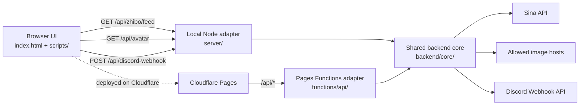
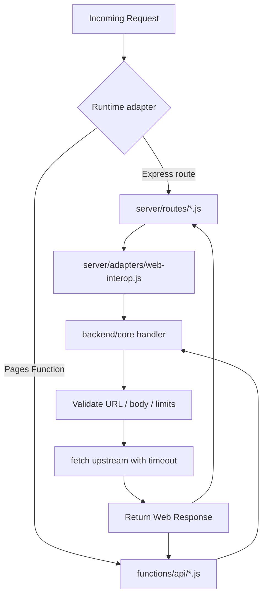
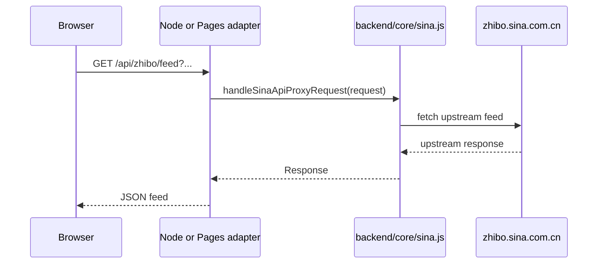

# Architecture

## Goal

This repository now separates the backend into:

- a shared runtime-agnostic core in `backend/core/`
- a local Node adapter layer in `server/`
- a Cloudflare Pages Functions adapter layer in `functions/api/`

The frontend still stays single-source and same-origin:

- `index.html` — page shell and static mount points
- `scripts/core/viewer-core.js` — feed lifecycle, filtering, rendering, stats, and modals
- `scripts/features/discord/` — optional Discord relay feature
- `scripts/app.js` — frontend bootstrap
- `styles/` — viewer and Discord styles

The guiding rule is:

- browser code should only call same-origin `/api/...`
- shared backend rules should live in `backend/core/`
- Node and Cloudflare files should be thin adapters

## System Overview

## Frontend Modules

### 1. Page Shell

`index.html` has four responsibilities:

- define document metadata and static asset links
- define the visible page structure
- expose stable DOM IDs for the viewer
- expose mount points for optional features

The two feature mount points are:

- `developerFeatureMount`
- `featureModalMount`

### 2. Viewer Core

`scripts/core/viewer-core.js` owns:

- feed fetching and merge logic
- filters and rendering
- sticky controls and stats
- attribute and comment modals
- feature hook registration

The core exposes a small public surface:

- `init()`
- `onLatestFeedReady(handler)`
- `onFeedItemsSynced(handler)`
- `getCurrentPrimaryItem()`
- `getCurrentBulkItems(limit)`
- `getFeatureMounts()`
- `buildRelayContext(item)`

### 3. Discord Feature

The Discord feature is still a browser-side optional package:

- `scripts/features/discord/template.js`
- `scripts/features/discord/feature.js`
- `styles/discord.css`

It injects its own UI, keeps its own browser state, formats messages, and calls the same-origin backend relay endpoint.

## Backend Layout

### Shared Core

`backend/core/` contains the runtime-agnostic backend logic:

- `config.js` — shared defaults and allowlists
- `hosts.js` — host suffix matching
- `http.js` — JSON responses, timeout-aware fetch helpers, and response cloning
- `sina.js` — Sina API target building and proxy handler
- `avatar.js` — avatar URL validation and image proxy handler
- `discord.js` — Discord webhook validation and relay handler

These modules use standard Web APIs:

- `Request`
- `Response`
- `fetch`
- `Headers`
- `URL`
- `AbortController`

That makes the core portable across local Node and Cloudflare.

### Local Node Adapter

The local Node server is now structured like this:

- `server.js` — minimal startup file
- `server/config.js` — local runtime config and root paths
- `server/adapters/web-interop.js` — Express <-> Web Request/Response bridge
- `server/create-app.js` — app composition
- `server/routes/health.js` — local-only health check
- `server/routes/zhibo-proxy.js` — thin adapter for the shared Sina handler
- `server/routes/avatar.js` — thin adapter for the shared avatar handler
- `server/routes/discord-webhook.js` — thin adapter for the shared Discord handler

### Cloudflare Adapter

The Cloudflare side now stays intentionally thin:

- `functions/api/zhibo/feed.js`
- `functions/api/avatar.js`
- `functions/api/discord-webhook.js`

Each file delegates into `backend/core/` with Cloudflare request objects and shared defaults.

## Backend Request Flow

## Current Data Flow

### Feed Flow

### Discord Flow

The current Discord flow is still browser-driven:

1. the Discord feature is installed by `scripts/app.js`
2. it keeps webhook state in browser memory
3. it decides whether to create or edit Discord messages
4. it sends requests to `/api/discord-webhook`
5. the backend validates the request and forwards it to Discord

This means the backend relay is shared now, but the relay orchestration itself is still in the browser.

## Why This Layout Is Easier To Maintain

This layout gives three practical benefits:

- the same backend rules only live in one place now
- local Node and Cloudflare stay supported without duplicating validation logic
- future work can move Discord orchestration out of the browser without rewriting route behavior twice
