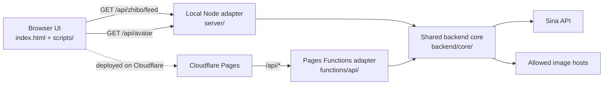
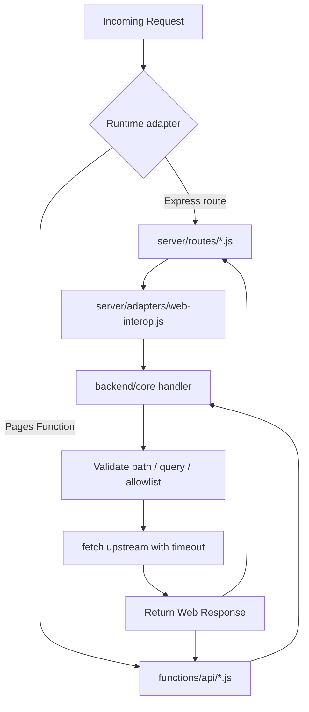
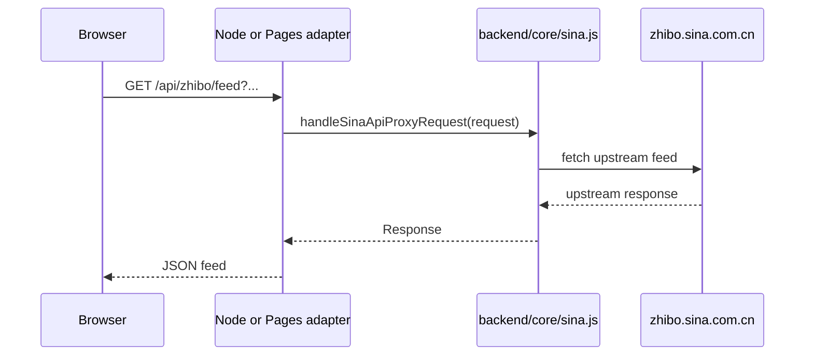

# Architecture

## Goal

This repository is organized around:

- a single browser frontend
- a shared runtime-agnostic backend core in `backend/core/`
- a local Node adapter layer in `server/`
- a Cloudflare Pages Functions adapter layer in `functions/api/`

The guiding rule is:

- browser code should only call same-origin `/api/...`
- shared backend rules should live in `backend/core/`
- Node and Cloudflare files should stay thin adapters

## System Overview

## Frontend Modules

### 1. Page Shell

`index.html` is responsible for:

- document metadata and static asset links
- the visible page structure
- stable DOM IDs for the viewer

### 2. Viewer Core

`scripts/core/viewer-core.js` owns:

- feed fetching and merge logic
- filters and rendering
- sticky controls and stats
- attribute and comment modals
- history loading

The public surface is intentionally small:

- `createViewerCore()`
- `init()`

### 3. Bootstrap

`scripts/app.js` is a thin startup file:

1. create the core viewer
2. initialize the core viewer

## Backend Layout

### Shared Core

`backend/core/` contains the runtime-agnostic backend logic:

- `config.js` — shared defaults and allowlists
- `hosts.js` — host suffix matching
- `http.js` — JSON responses, timeout-aware fetch helpers, and response cloning
- `sina.js` — Sina API target building and proxy handler
- `avatar.js` — avatar URL validation and image proxy handler

These modules use standard Web APIs:

- `Request`
- `Response`
- `fetch`
- `Headers`
- `URL`
- `AbortController`

That keeps the core portable across local Node and Cloudflare.

### Local Node Adapter

The local Node server is structured like this:

- `server.js` — minimal startup file
- `server/config.js` — local runtime config and root paths
- `server/adapters/web-interop.js` — Express <-> Web Request/Response bridge
- `server/create-app.js` — app composition
- `server/routes/health.js` — local-only health check
- `server/routes/zhibo-proxy.js` — thin adapter for the shared Sina handler
- `server/routes/avatar.js` — thin adapter for the shared avatar handler

### Cloudflare Adapter

The Cloudflare side stays intentionally thin:

- `functions/api/zhibo/feed.js`
- `functions/api/avatar.js`

Each file delegates into `backend/core/` with Cloudflare request objects and shared defaults.

## Backend Request Flow

## Data Flow

## Why This Layout Is Easier To Maintain

This layout gives three practical benefits:

- the same backend rules only live in one place
- local Node and Cloudflare stay supported without duplicated proxy logic
- the frontend stays focused on viewing and filtering feed items
