# Architecture

## Goal

This repository is organized around:

- a single browser frontend
- a shared runtime-agnostic backend core in `backend/core/`
- a local Node adapter layer in `server/`
- a Cloudflare Pages Functions adapter layer in `functions/api/`

The guiding rule is:

- browser code should only call same-origin `/api/...`
- shared backend rules should live in `backend/core/`
- Node and Cloudflare files should stay thin adapters

## System Overview

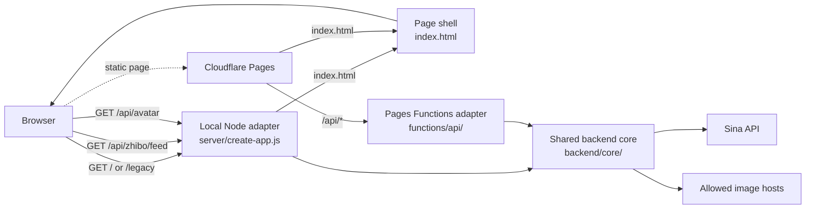
```mermaid
flowchart LR
  Browser["Browser"] -->|GET / or /legacy| Node["Local Node adapter<br/>server/create-app.js"]
  Node -->|index.html| Page["Page shell<br/>index.html"]
  Page --> Browser

  Browser -->|GET /api/zhibo/feed| Node
  Browser -->|GET /api/avatar| Node

  Browser -. static page .-> Pages["Cloudflare Pages"]
  Pages -->|index.html| Page
  Pages -->|/api/*| Functions["Pages Functions adapter<br/>functions/api/"]

  Node --> Core["Shared backend core<br/>backend/core/"]
  Functions --> Core

  Core --> Sina["Sina API"]
  Core --> Avatar["Allowed image hosts"]
```

## Frontend Modules

### 1. Page Shell

`index.html` is responsible for:

- document metadata and static asset links
- the visible page structure
- stable DOM IDs for the viewer

### 2. Viewer Core

`scripts/core/viewer-core.js` owns:

- feed fetching, merging, filtering, rendering, and history loading
- third-party text escaping and HTTP(S)-only image and document URLs
- standard and minimal display modes, controls, and statistics
- attribute and comment modals

#### Viewer lifecycle

Both routes use the same viewer core. The route and stored preference select the display mode, then the core attaches controls, requests the initial 100-item window, renders it, and starts the normal timer when the page is visible.

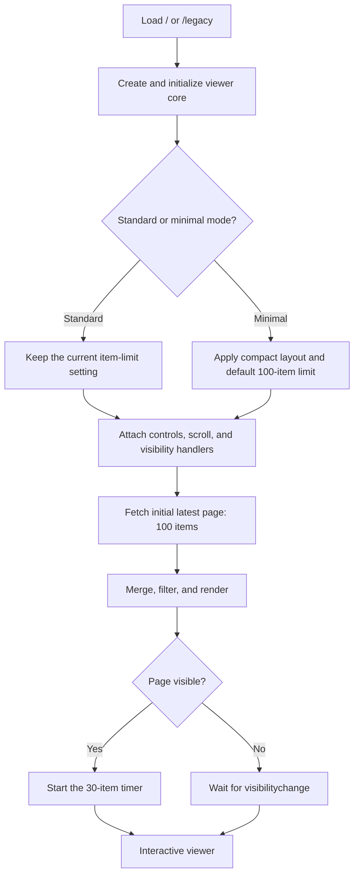
```mermaid
flowchart TD
  A["Load / or /legacy"] --> B["Create and initialize viewer core"]
  B --> C{"Standard or minimal mode?"}
  C -->|"Standard"| D["Keep the current item-limit setting"]
  C -->|"Minimal"| E["Apply compact layout and default 100-item limit"]
  D --> F["Attach controls, scroll, and visibility handlers"]
  E --> F
  F --> G["Fetch initial latest page: 100 items"]
  G --> H["Merge, filter, and render"]
  H --> I{"Page visible?"}
  I -->|"Yes"| J["Start the 30-item timer"]
  I -->|"No"| K["Wait for visibilitychange"]
  J --> L["Interactive viewer"]
  K --> L
```

Route changes use the browser History API and reapply the same core state; they do not create a second viewer or a second refresh service.

#### Mode and item-limit transitions

Minimal mode temporarily owns the item-limit state. Entering minimal mode remembers the standard-mode setting and forces the 100-item window. Its bottom control removes that limit and permits older-page loading. Leaving minimal mode restores the remembered standard-mode setting.

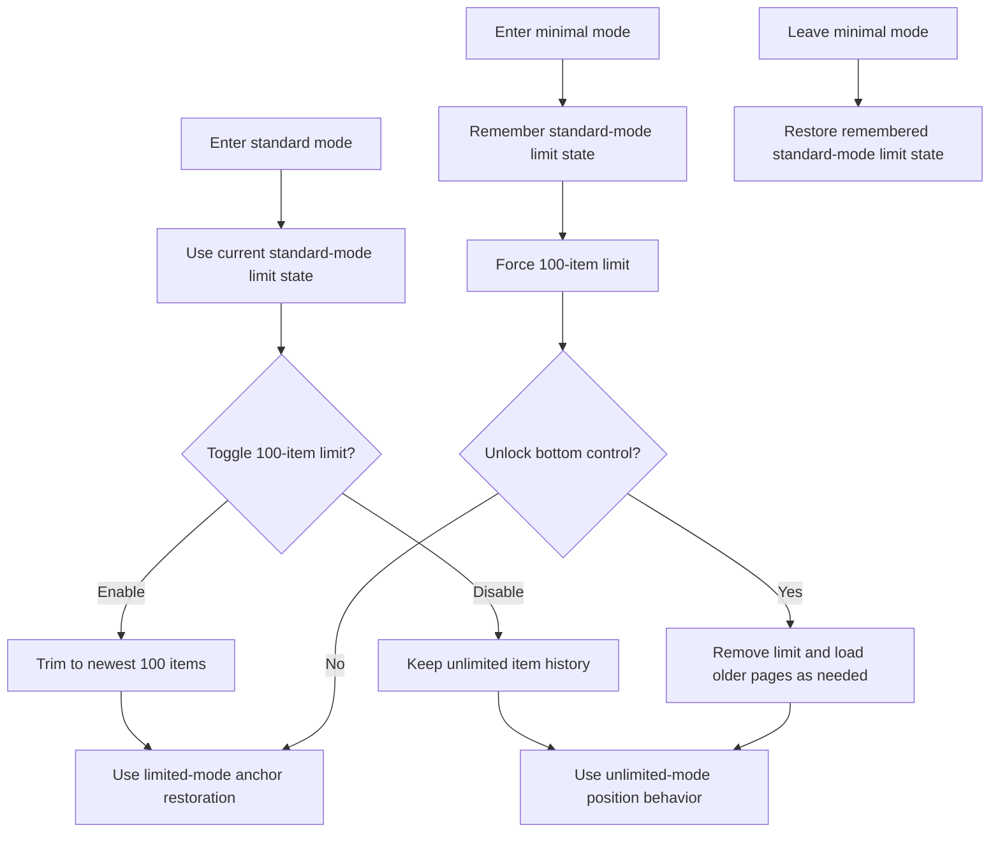
```mermaid
flowchart TD
  A["Enter standard mode"] --> B["Use current standard-mode limit state"]
  B --> C{"Toggle 100-item limit?"}
  C -->|"Enable"| D["Trim to newest 100 items"]
  C -->|"Disable"| E["Keep unlimited item history"]
  D --> F["Use limited-mode anchor restoration"]
  E --> G["Use unlimited-mode position behavior"]
  H["Enter minimal mode"] --> I["Remember standard-mode limit state"]
  I --> J["Force 100-item limit"]
  J --> K{"Unlock bottom control?"}
  K -->|"No"| F
  K -->|"Yes"| L["Remove limit and load older pages as needed"]
  L --> G
  M["Leave minimal mode"] --> N["Restore remembered standard-mode limit state"]
```

The standard and minimal routes therefore share one rule: the 100-item limit enables exact-card restoration; unlimited mode keeps only the simple edge behavior documented below.

#### Feed processing pipeline

Every latest or history response passes through the same merge path. Items are deduplicated by ID, normalized to descending ID order, optionally trimmed to 100, then either rerendered or incrementally updated.

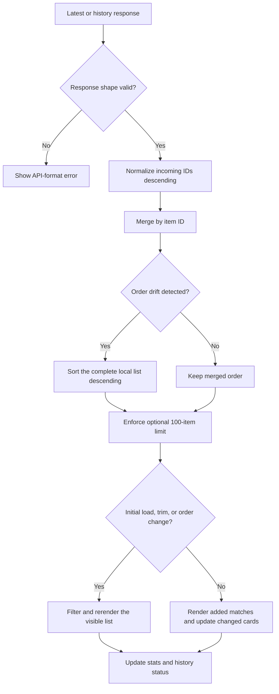
```mermaid
flowchart TD
  A["Latest or history response"] --> B{"Response shape valid?"}
  B -->|"No"| C["Show API-format error"]
  B -->|"Yes"| D["Normalize incoming IDs descending"]
  D --> E["Merge by item ID"]
  E --> F{"Order drift detected?"}
  F -->|"Yes"| G["Sort the complete local list descending"]
  F -->|"No"| H["Keep merged order"]
  G --> I["Enforce optional 100-item limit"]
  H --> I
  I --> J{"Initial load, trim, or order change?"}
  J -->|"Yes"| K["Filter and rerender the visible list"]
  J -->|"No"| L["Render added matches and update changed cards"]
  K --> M["Update stats and history status"]
  L --> M
```

This shared path is why latest refresh and history pagination cannot silently maintain two conflicting copies of the feed.

#### History pagination

The history sentinel asks for the next 100-item page only when the viewer is ready: it is not on the first load, another request is not active, refresh is not paused, the feed is not exhausted, and the 100-item limit has not already been reached. Empty or duplicate pages are skipped until new content appears or the upstream end is reached.

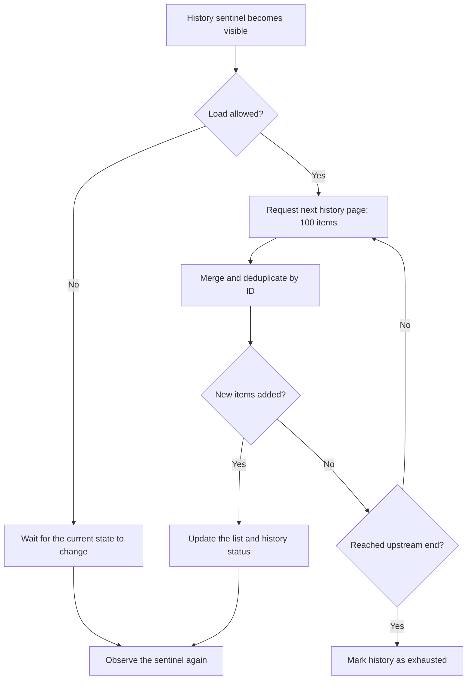
```mermaid
flowchart TD
  A["History sentinel becomes visible"] --> B{"Load allowed?"}
  B -->|"No"| C["Wait for the current state to change"]
  B -->|"Yes"| D["Request next history page: 100 items"]
  D --> E["Merge and deduplicate by ID"]
  E --> F{"New items added?"}
  F -->|"Yes"| G["Update the list and history status"]
  F -->|"No"| H{"Reached upstream end?"}
  H -->|"No"| D
  H -->|"Yes"| I["Mark history as exhausted"]
  G --> J["Observe the sentinel again"]
  C --> J
```

#### Retry and failure path

The request helper handles timeout, network, HTTP, and JSON parsing failures with the same bounded retry policy. A response that parses successfully but has an invalid feed shape is rejected by the feed processor and shown as an API-format error; it is not retried as a transport failure.

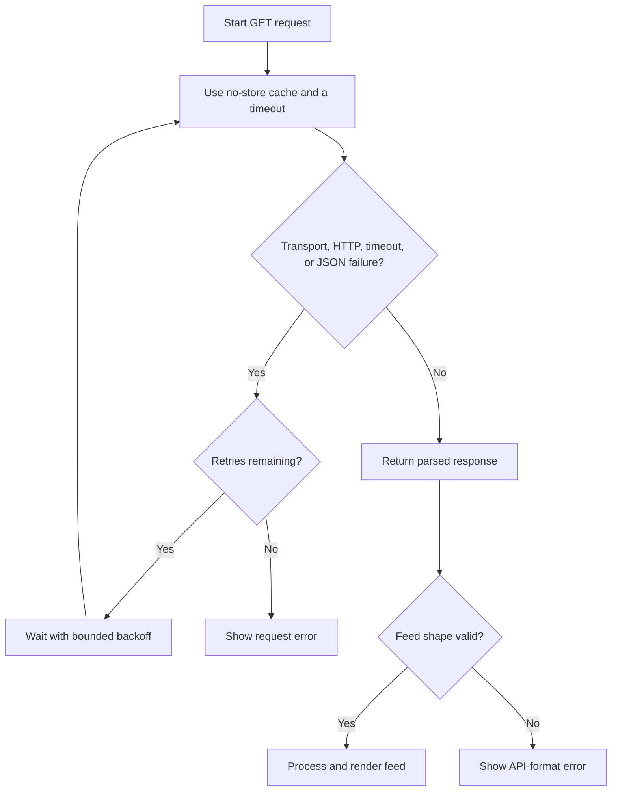
```mermaid
flowchart TD
  A["Start GET request"] --> B["Use no-store cache and a timeout"]
  B --> C{"Transport, HTTP, timeout, or JSON failure?"}
  C -->|"No"| D["Return parsed response"]
  C -->|"Yes"| E{"Retries remaining?"}
  E -->|"Yes"| F["Wait with bounded backoff"]
  F --> B
  E -->|"No"| G["Show request error"]
  D --> H{"Feed shape valid?"}
  H -->|"Yes"| I["Process and render feed"]
  H -->|"No"| J["Show API-format error"]
```

### Display Modes and Route Handling

The viewer uses one HTML shell and two page routes:

- `/` — standard interface. The control panel may use sticky positioning and the statistics bar is available.
- `/legacy` — minimal interface.

In minimal mode, the frontend also:

- keeps the toolbar in normal document flow and hides the statistics bar and per-item “全部属性”, “评论”, and “原文” actions;
- enforces a 100-item default limit, with a bottom control that removes the limit and unlocks item-limit adjustment until leaving minimal mode or refreshing.

### Refresh and Scroll Anchors

The implementation stays in `scripts/core/viewer-core.js`. The policy is deliberately kept in the existing viewer core; it does not need a separate refresh service, event bus, cache, state abstraction, or dependency.

#### Request policy

| Trigger | Latest-page size | Behavior |
| --- | ---: | --- |
| First load | 100 | Populate the initial feed window. |
| In-window timer | 30 | Reduce API frequency during normal viewing. |
| Manual refresh | 100 | Clear the manual-refresh gate and catch up. |
| Return from a hidden page before 24 hours | 100 | Catch up through later pages until one overlaps locally loaded items. |
| Return after 24 hours hidden | 0 automatically | Do not perform an unbounded catch-up; show that manual refresh is required. |
| History pagination | 100 | Load older content using the same page window as the initial feed. |

Each request is allowed two retries after the initial attempt. `document.hidden` is the only background signal: a window that is merely unfocused or covered remains visible and continues its normal 30-item timer.

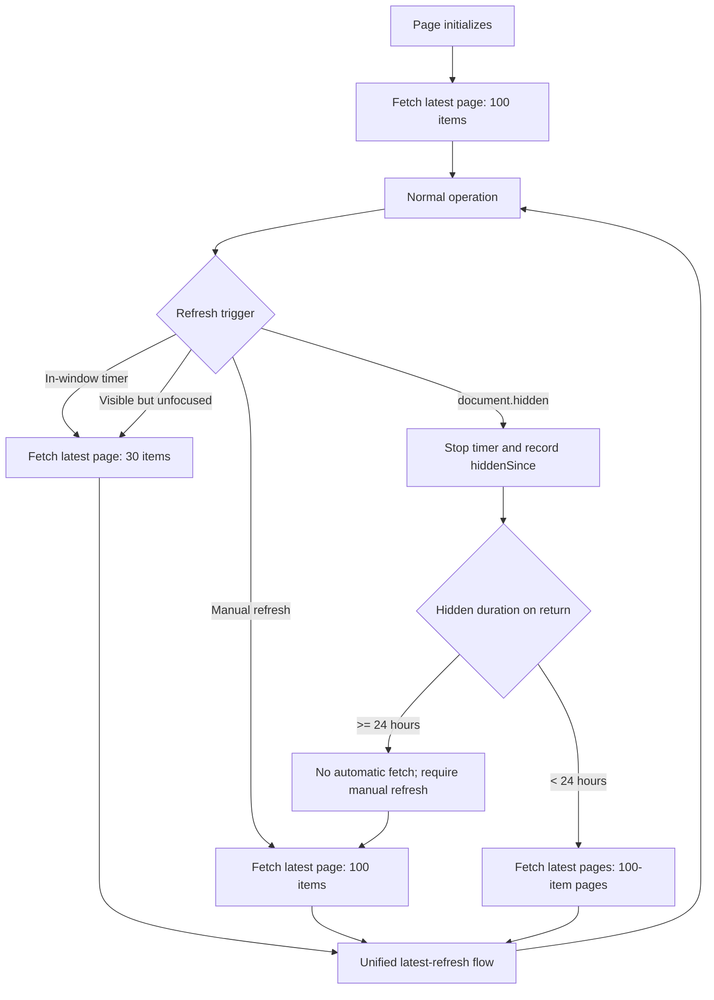
```mermaid
flowchart TD
  A["Page initializes"] --> B["Fetch latest page: 100 items"]
  B --> C["Normal operation"]
  C --> D{"Refresh trigger"}
  D -->|"In-window timer"| E["Fetch latest page: 30 items"]
  D -->|"Manual refresh"| F["Fetch latest page: 100 items"]
  D -->|"Visible but unfocused"| E
  D -->|"document.hidden"| G["Stop timer and record hiddenSince"]
  G --> H{"Hidden duration on return"}
  H -->|"< 24 hours"| I["Fetch latest pages: 100-item pages"]
  H -->|">= 24 hours"| J["No automatic fetch; require manual refresh"]
  J --> F
  E --> K["Unified latest-refresh flow"]
  F --> K
  I --> K
  K --> C
```

Latest catch-up starts with page 1. If it has no overlap with locally known items, the viewer requests subsequent latest pages until it finds overlap or reaches the upstream end. This prevents a quiet page-size boundary from silently dropping news.

#### Anchor selection

During a limited refresh, the anchor is the rendered `.content-item` crossing the line at 25% of the viewport height. If no card crosses that line, the first visible card below it is used; if there is no card below it, the last visible card is used. The viewer records the card ID, its screen-space top, whether it is the last rendered card, and whether the viewport is at the top or bottom.

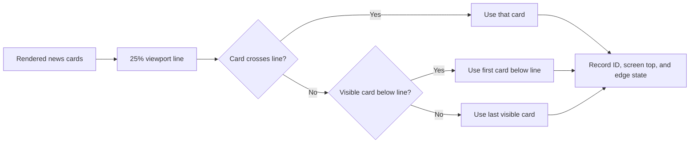
```mermaid
flowchart LR
  A["Rendered news cards"] --> B["25% viewport line"]
  B --> C{"Card crosses line?"}
  C -->|"Yes"| D["Use that card"]
  C -->|"No"| E{"Visible card below line?"}
  E -->|"Yes"| F["Use first card below line"]
  E -->|"No"| G["Use last visible card"]
  D --> H["Record ID, screen top, and edge state"]
  F --> H
  G --> H
```

While a latest request is pending, scroll input updates the candidate anchor on the next animation frame. The final anchor is captured immediately before the list is changed, so a wheel or touch gesture wins over the position captured when the request started. Top and bottom buttons explicitly invalidate restoration.

Filter, search, type, focus, title/source display, mode, and item-limit changes invalidate the old anchor. This avoids restoring a card in a different rendered list. Image dimensions are intentionally not reserved because the user considers the resulting layout shift rare and the extra mechanism unnecessary.

#### Anchor restoration

The exact-card restore applies only while the 100-item limit is enabled, in both standard and minimal modes. Removing that limit intentionally uses the ordinary unlimited-feed behavior: top remains top, but a middle or bottom position is not forcefully mapped back to an old card.

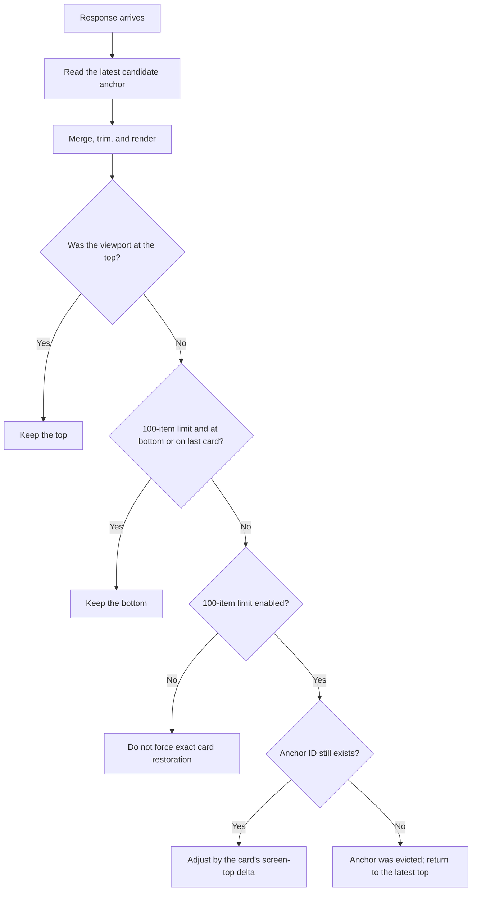
```mermaid
flowchart TD
  A["Response arrives"] --> B["Read the latest candidate anchor"]
  B --> C["Merge, trim, and render"]
  C --> D{"Was the viewport at the top?"}
  D -->|"Yes"| E["Keep the top"]
  D -->|"No"| F{"100-item limit and at bottom or on last card?"}
  F -->|"Yes"| G["Keep the bottom"]
  F -->|"No"| H{"100-item limit enabled?"}
  H -->|"No"| I["Do not force exact card restoration"]
  H -->|"Yes"| J{"Anchor ID still exists?"}
  J -->|"Yes"| K["Adjust by the card's screen-top delta"]
  J -->|"No"| L["Anchor was evicted; return to the latest top"]
```

This gives the intended human behavior:

- Reading in the middle preserves the same news card while it remains in the 100-item window.
- If that card is evicted, the viewer returns to the latest top rather than guessing a replacement.
- If the anchor is the last card, or the viewport is already at the bottom, the viewer remains at the bottom.
- If the user scrolls during the request, the gesture becomes the new anchor instead of being overwritten by stale state.
- At the top, the viewer stays at the top so the newest news remains visible.

#### Refresh/history serialization

Latest refresh and history pagination share the viewer's existing in-flight flags. A latest refresh requested while history is loading is queued with the larger requested page size; a history request waits while latest refresh is active. After history completes, the queued latest refresh is started only if the page is still visible and refresh is not paused.

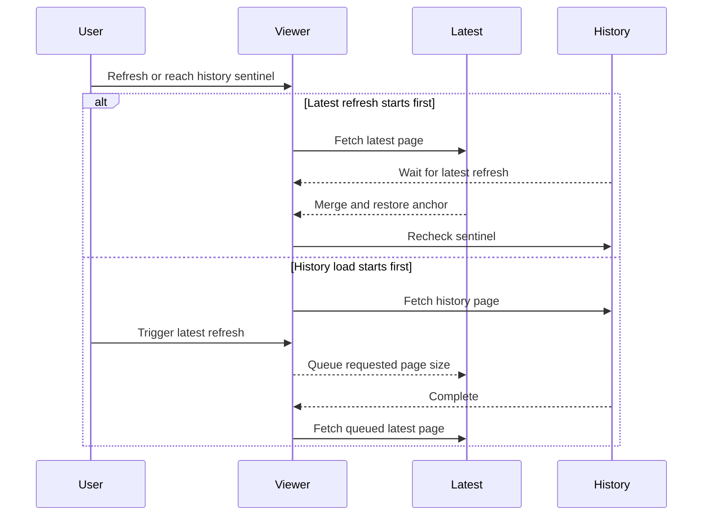
```mermaid
sequenceDiagram
  participant User
  participant Viewer
  participant Latest
  participant History

  User->>Viewer: Refresh or reach history sentinel
  alt Latest refresh starts first
    Viewer->>Latest: Fetch latest page
    History-->>Viewer: Wait for latest refresh
    Latest-->>Viewer: Merge and restore anchor
    Viewer->>History: Recheck sentinel
  else History load starts first
    Viewer->>History: Fetch history page
    User->>Viewer: Trigger latest refresh
    Viewer-->>Latest: Queue requested page size
    History-->>Viewer: Complete
    Viewer->>Latest: Fetch queued latest page
  end
```

#### Complexity boundary

The state variables correspond directly to observable requirements: in-flight refresh/history guards, the dynamic anchor and its animation-frame capture, a queued page size, hidden-time tracking, and the 24-hour manual gate. No speculative abstraction is warranted until another independent feed or list needs the same behavior. The Mermaid diagrams are source-maintained documentation; no generated image asset is needed.

### 3. Bootstrap

`scripts/app.js` is a thin startup file:

1. create the core viewer
2. initialize the core viewer

## Backend Layout

### Shared Core

`backend/core/` contains the runtime-agnostic backend logic:

- `config.js` — shared defaults and allowlists
- `hosts.js` — host suffix matching
- `http.js` — JSON responses, timeout-aware fetch helpers, and response cloning
- `sina.js` — Sina API target building and proxy handler
- `avatar.js` — avatar URL validation and image proxy handler

### Local Node Adapter

The local Node server is structured like this:

- `server.js` — minimal startup file
- `server/config.js` — local runtime config and root paths
- `server/adapters/web-interop.js` — Express <-> Web Request/Response bridge
- `server/create-app.js` — app composition

### Cloudflare Adapter

The Cloudflare side stays intentionally thin:

- `functions/api/zhibo/feed.js`
- `functions/api/avatar.js`

Each file delegates into `backend/core/` with Cloudflare request objects and shared defaults.

## Data Flow

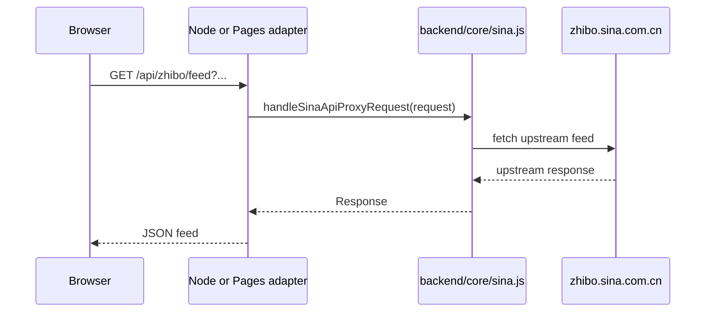
```mermaid
sequenceDiagram
  participant Browser
  participant Adapter as Node or Pages adapter
  participant Core as backend/core/sina.js
  participant Sina as zhibo.sina.com.cn

  Browser->>Adapter: GET /api/zhibo/feed?...
  Adapter->>Core: handleSinaApiProxyRequest(request)
  Core->>Sina: fetch upstream feed
  Sina-->>Core: upstream response
  Core-->>Adapter: Response
  Adapter-->>Browser: JSON feed
```
