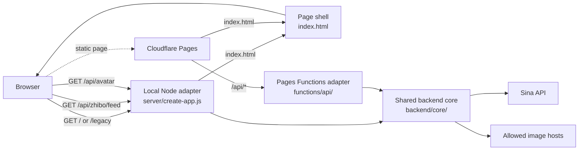
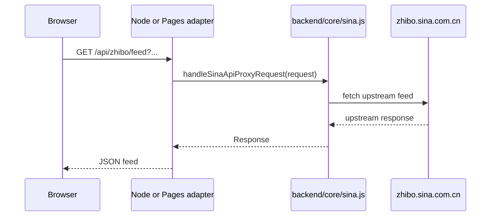

# Architecture

## Goal

This repository is organized around:

- a single browser frontend
- a shared runtime-agnostic backend core in `backend/core/`
- a local Node adapter layer in `server/`
- a Cloudflare Pages Functions adapter layer in `functions/api/`

The guiding rule is:

- browser code should only call same-origin `/api/...`
- shared backend rules should live in `backend/core/`
- Node and Cloudflare files should stay thin adapters

## System Overview

```mermaid
flowchart LR
  Browser["Browser"] -->|GET / or /legacy| Node["Local Node adapter<br/>server/create-app.js"]
  Node -->|index.html| Page["Page shell<br/>index.html"]
  Page --> Browser

  Browser -->|GET /api/zhibo/feed| Node
  Browser -->|GET /api/avatar| Node

  Browser -. static page .-> Pages["Cloudflare Pages"]
  Pages -->|index.html| Page
  Pages -->|/api/*| Functions["Pages Functions adapter<br/>functions/api/"]

  Node --> Core["Shared backend core<br/>backend/core/"]
  Functions --> Core

  Core --> Sina["Sina API"]
  Core --> Avatar["Allowed image hosts"]
```

## Frontend Modules

### 1. Page Shell

`index.html` is responsible for:

- document metadata and static asset links
- the visible page structure
- stable DOM IDs for the viewer

### 2. Viewer Core

`scripts/core/viewer-core.js` owns:

- feed fetching, merging, filtering, rendering, and history loading
- third-party text escaping and HTTP(S)-only image and document URLs
- standard and minimal display modes, controls, and statistics
- attribute and comment modals

### Display Modes and Route Handling

The viewer uses one HTML shell and two page routes:

- `/` — standard interface. The control panel may use sticky positioning and the statistics bar is available.
- `/legacy` — minimal interface.

In minimal mode, the frontend also:

- keeps the toolbar in normal document flow and hides the statistics bar and per-item “全部属性”, “评论”, and “原文” actions;
- enforces a 100-item default limit, with a bottom control that removes the limit and unlocks item-limit adjustment until leaving minimal mode or refreshing.

### 3. Bootstrap

`scripts/app.js` is a thin startup file:

1. create the core viewer
2. initialize the core viewer

## Backend Layout

### Shared Core

`backend/core/` contains the runtime-agnostic backend logic:

- `config.js` — shared defaults and allowlists
- `hosts.js` — host suffix matching
- `http.js` — JSON responses, timeout-aware fetch helpers, and response cloning
- `sina.js` — Sina API target building and proxy handler
- `avatar.js` — avatar URL validation and image proxy handler

### Local Node Adapter

The local Node server is structured like this:

- `server.js` — minimal startup file
- `server/config.js` — local runtime config and root paths
- `server/adapters/web-interop.js` — Express <-> Web Request/Response bridge
- `server/create-app.js` — app composition

### Cloudflare Adapter

The Cloudflare side stays intentionally thin:

- `functions/api/zhibo/feed.js`
- `functions/api/avatar.js`

Each file delegates into `backend/core/` with Cloudflare request objects and shared defaults.

## Data Flow

```mermaid
sequenceDiagram
  participant Browser
  participant Adapter as Node or Pages adapter
  participant Core as backend/core/sina.js
  participant Sina as zhibo.sina.com.cn

  Browser->>Adapter: GET /api/zhibo/feed?...
  Adapter->>Core: handleSinaApiProxyRequest(request)
  Core->>Sina: fetch upstream feed
  Sina-->>Core: upstream response
  Core-->>Adapter: Response
  Adapter-->>Browser: JSON feed
```
