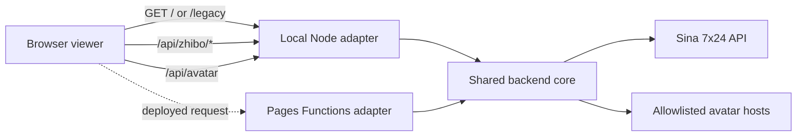
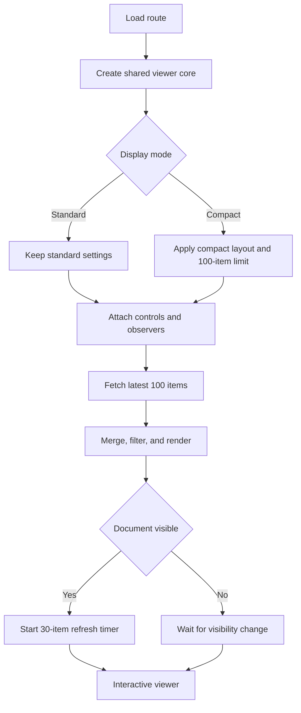
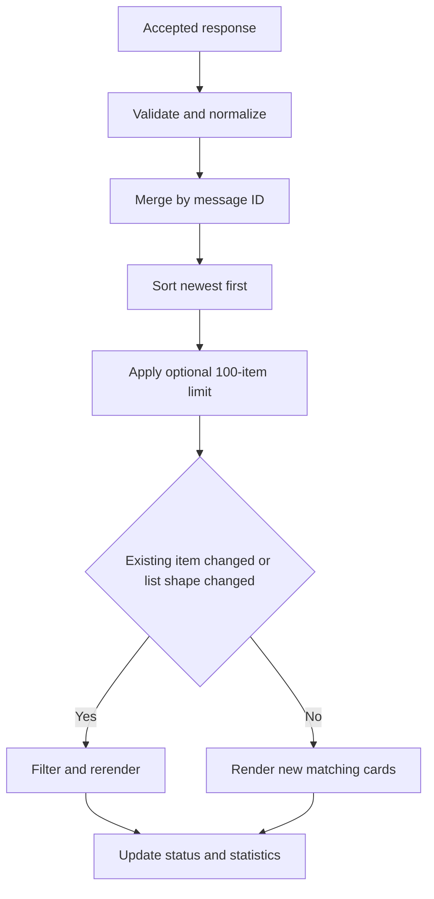
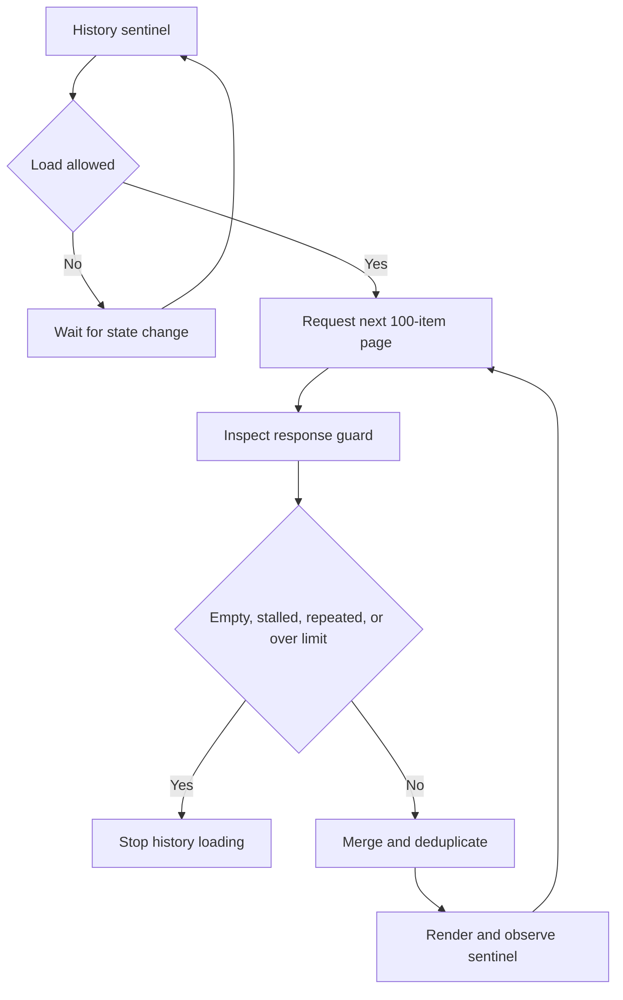
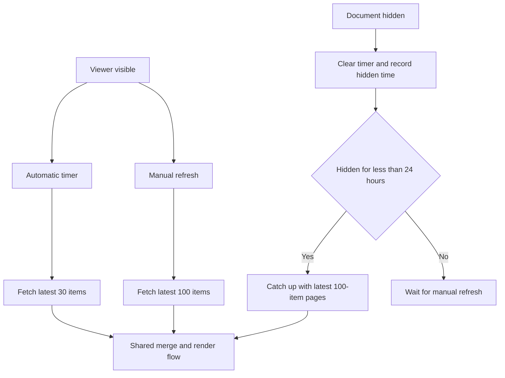
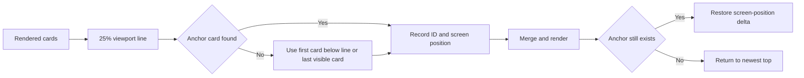

# Architecture

This document describes the implementation. User-facing usage, supported routes, and local run instructions belong in README.md and README.zh-CN.md.

## System boundaries

The application has one browser viewer and two thin server adapters.

    Browser
      |
      +-- local Node adapter: server/
      |
      +-- Cloudflare Pages adapter: functions/
      |
      +-- shared backend rules: backend/core/
      |
      +-- Sina Finance API and allowlisted avatar hosts

The browser only calls same-origin endpoints. Shared validation, proxying, and upstream handling live in backend/core/. The local server and Pages Functions layers adapt their platform request and response types to that shared core.

## System overview

```mermaid
flowchart LR
  Browser["Browser viewer"] -->|GET / or /legacy| Node["Local Node adapter"]
  Browser -->|/api/zhibo/*| Node
  Browser -->|/api/avatar| Node
  Browser -. deployed request .-> Functions["Pages Functions adapter"]
  Node --> Core["Shared backend core"]
  Functions --> Core
  Core --> Sina["Sina 7x24 API"]
  Core --> Avatar["Allowlisted avatar hosts"]
```

## Repository layout

| Area | Responsibility |
| --- | --- |
| index.html | Static document shell and viewer mount points |
| scripts/app.js | Browser bootstrap and route setup |
| scripts/core/viewer-core.js | Viewer state, requests, pagination, filtering, rendering, refresh, and interaction |
| scripts/core/*.test.js | Node built-in regression tests for extracted viewer rules |
| styles/ | Standard and compact viewer styling |
| backend/core/ | Runtime-independent proxy and validation logic |
| server/ | Local Node adapter and application composition |
| functions/api/ | Cloudflare Pages Functions routes |

## Browser runtime

Both routes use the same viewer core:

    /        -> standard interface
    /legacy  -> compact interface

The route selects the display mode before the core attaches controls, scroll handling, visibility handling, and the refresh timer. A route change reuses the same page shell and viewer state; it does not start a second refresh service.

The standard interface exposes the full toolbar, statistics, item attributes, comments, and original-link actions. The compact interface keeps a text-first timeline, hides per-item secondary actions and statistics, and temporarily applies the 100-item limit until the user unlocks it or leaves the mode.

```mermaid
flowchart TD
  A["Load route"] --> B["Create shared viewer core"]
  B --> C{"Display mode"}
  C -->|Standard| D["Keep standard settings"]
  C -->|Compact| E["Apply compact layout and 100-item limit"]
  D --> F["Attach controls and observers"]
  E --> F
  F --> G["Fetch latest 100 items"]
  G --> H["Merge, filter, and render"]
  H --> I{"Document visible"}
  I -->|Yes| J["Start 30-item refresh timer"]
  I -->|No| K["Wait for visibility change"]
  J --> L["Interactive viewer"]
  K --> L
```

## Viewer state

The core keeps these state groups together in viewer-core.js:

| State | Purpose |
| --- | --- |
| items | Merged feed items, deduplicated by message ID and ordered newest first |
| currentPage | Last history page accepted by the pagination flow |
| hasMorePages | Whether the history sentinel may request another page |
| isLoadingMore | Prevents overlapping history requests |
| isRefreshing | Prevents refresh and history flows from mutating the list concurrently |
| refreshPaused | Stops user-triggered history work while refresh is paused |
| limitItems | Enables or disables the optional 100-item window |
| search and filter values | Determine the visible subset |
| refresh interval | User-configured automatic refresh period |

Latest refresh and history loading use separate entry points but share the same merge, validation, filtering, rendering, and pagination-guard rules.

## Feed processing

Every accepted response follows this sequence:

    validate response shape
      -> normalize incoming items
      -> merge by message ID
      -> sort newest first when needed
      -> apply the optional 100-item limit
      -> re-evaluate filters
      -> render and update status

When an existing item changes, the visible result is filtered again. This allows a card to disappear when updated text, tags, or comments stop matching and allows it to appear when those fields begin matching. New matching cards may be inserted incrementally when a full rerender is unnecessary.

The optional item limit keeps the newest items. If trimming removes loaded history, the history cursor is reset to page 1 and history loading is reopened. Disabling the limit then starts from the first older page and relies on message-ID deduplication to preserve every item across the overlap.

```mermaid
flowchart TD
  A["Accepted response"] --> B["Validate and normalize"]
  B --> C["Merge by message ID"]
  C --> D["Sort newest first"]
  D --> E["Apply optional 100-item limit"]
  E --> F{"Existing item changed or list shape changed"}
  F -->|Yes| G["Filter and rerender"]
  F -->|No| H["Render new matching cards"]
  G --> I["Update status and statistics"]
  H --> I
```

## Search and filters

The searchable representation includes:

- item content, message ID, time, and source;
- tag IDs and names;
- comment nicknames, text, area, user IDs, timestamps, agreement counts, and ranks.

Tag and comment collections are read only when they are arrays. Unexpected upstream values are treated as empty collections so malformed optional data cannot abort filtering or rendering.

The same normalized item is used for type filters, text search, rendering, and comment display. This keeps the visible card and the search result based on the same upstream record.

## History pagination

The history sentinel requests pages of 100 items when all of these conditions hold:

- the first load is complete;
- no refresh or history request is active;
- history loading is not paused;
- hasMorePages is true;
- the 100-item limit is not currently preventing older items from being requested.

The client does not use upstream total-page metadata as an end condition. A shared pagination guard stops a flow when any of the following occurs:

1. the response is empty;
2. the accepted response page does not advance;
3. the response ID fingerprint repeats;
4. the per-flow safety limit of 100 pages is reached.

The guard is shared by latest catch-up and history loading. It prevents an upstream server that clamps large page numbers to the same non-empty page from creating an endless request loop. A page that advances and has a new fingerprint may be accepted even when it contributes no new local IDs; overlap is handled by the merge step.

When item trimming resets the cursor, the next history request starts at page 2. The current page remains page 1 until that request succeeds, so a failed request cannot advance the cursor.

```mermaid
flowchart TD
  A["History sentinel"] --> B{"Load allowed"}
  B -->|No| C["Wait for state change"]
  B -->|Yes| D["Request next 100-item page"]
  D --> E["Inspect response guard"]
  E --> F{"Empty, stalled, repeated, or over limit"}
  F -->|Yes| G["Stop history loading"]
  F -->|No| H["Merge and deduplicate"]
  H --> I["Render and observe sentinel"]
  I --> D
  C --> A
```

## Refresh policy

| Trigger | Request size | Result |
| --- | ---: | --- |
| Initial load | 100 | Populate the initial window |
| Manual refresh | 100 | Perform an explicit latest refresh |
| Automatic refresh while visible | 30 | Update the newest items at the configured interval |
| Return after being hidden for less than 24 hours | 100 | Catch up through later pages until overlap or a guard stop |
| Return after being hidden for 24 hours or more | 0 automatically | Wait for manual refresh |
| History pagination | 100 | Request older items under the shared guard |

The refresh interval accepts 1 through 86,400 seconds. The same bound is used by the input element and runtime normalization, keeping the millisecond value below the browser timer overflow boundary. The timer is cleared while the document is hidden and restarted when the page becomes visible.

The request helper uses a 10-second timeout and permits two retries after the initial attempt. Transport, HTTP, timeout, and JSON parsing failures use this retry path. A successfully parsed response with an invalid feed shape is an API-format error and is not retried as a transport failure.

```mermaid
flowchart TD
  A["Viewer visible"] --> B["Automatic timer"]
  B --> C["Fetch latest 30 items"]
  A --> D["Manual refresh"]
  D --> E["Fetch latest 100 items"]
  F["Document hidden"] --> G["Clear timer and record hidden time"]
  G --> H{"Hidden for less than 24 hours"}
  H -->|Yes| I["Catch up with latest 100-item pages"]
  H -->|No| J["Wait for manual refresh"]
  C --> K["Shared merge and render flow"]
  E --> K
  I --> K
```

## Scroll anchors

When the 100-item limit is enabled, a refresh captures the rendered card crossing the 25-percent viewport line. If no card crosses that line, it chooses the first visible card below it or the last visible card. The captured state includes the message ID, screen position, and top/bottom edge state.

After merging and rendering:

- a top position stays at the top;
- a bottom position or last-card anchor stays at the bottom;
- an existing anchor is restored by its screen-position delta;
- an evicted anchor returns to the newest top.

Search, filters, type changes, focus changes, title/source display, route mode, and item-limit changes invalidate the old anchor. Unlimited mode intentionally uses ordinary browser position behavior instead of forcing exact card restoration.

```mermaid
flowchart LR
  A["Rendered cards"] --> B["25% viewport line"]
  B --> C{"Anchor card found"}
  C -->|Yes| D["Record ID and screen position"]
  C -->|No| E["Use first card below line or last visible card"]
  E --> D
  D --> F["Merge and render"]
  F --> G{"Anchor still exists"}
  G -->|Yes| H["Restore screen-position delta"]
  G -->|No| I["Return to newest top"]
```

## Display safety

Upstream text is inserted as text or escaped HTML. Remote images and document links are accepted only for HTTP(S) URLs that pass the viewer’s allowlist rules. Optional tag and comment fields are normalized before they reach filtering, HTML generation, or modal rendering.

## Backend adapters

The shared backend core owns upstream URL construction, request validation, response handling, and allowlisted avatar proxy behavior. The local server mounts the static pages and exposes the same-origin API during development. The Pages Functions adapter exposes equivalent API routes in the deployment environment.

Keeping the adapters thin prevents environment-specific routing behavior from leaking into the browser viewer or duplicating upstream validation.

## Regression coverage

The test suite focuses on rules that can regress without a browser:

- pagination stops on empty, stalled, repeated, and excessive pages;
- automatic refresh interval bounds are enforced;
- tags and comment fields are included in search;
- malformed optional arrays do not break search indexing.

Run the suite with:

    npm test

Production dependency checks use:

    npm audit --omit=dev
